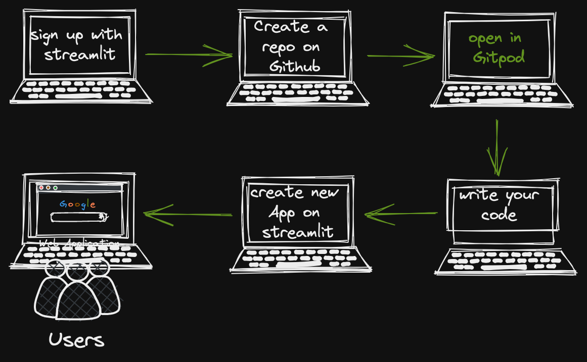

# Crypto Price App

Cryptocurrency nowadays is in most demand and many people are investing in these currencies to get high returns. Many websites and applications provide us information about the rates of different cryptocurrencies available in the crypto market. A crypto exchange API is a service to interface with cryptocurrency exchanges like [Binance.](https://www.binance.com/en) It allows users (either customers of the service or developers) to interface with cryptocurrency exchanges, execute trades, pull data, and receive data in real-time. 

This Project App was created using [Streamlit.](https://streamlit.io/)

---

👉 [App can be found here ](https://flow-matic-crypto-price-app-assetspythonapp-cs4spv.streamlitapp.com/)  👈

---
Introduction to [Streamlit:](https://docs.streamlit.io/)

* Streamlit is an open-source python library for creating and sharing web apps for data science and machine learning projects. The library can help you create and deploy your data science solution with a few lines of code.

* Streamlit can seamlessly integrate with other popular python libraries used in data science such as [Numpy,](https://numpy.org/) [Pandas,](https://pandas.pydata.org/) [Matplotlib,](https://matplotlib.org/) [Scikit-learn](https://scikit-learn.org/stable/) and many more.

* Streamlit uses [React](https://reactjs.org/) as a frontend framework to render the data on the screen.

* Streamlit allows you to write an app the same way you write a python code. Streamlit makes it seamless to work on the interactive loop of coding and viewing results in the web app.

___

Streamlit cloud:
---

* Streamlit cloud lets you deploy your apps in just one click, and most apps will deploy in only a few minutes.

* Streamlit Cloud is a workspace for your team to deploy, manage, and collaborate on your Streamlit apps. You connect your Streamlit Cloud account directly to your GitHub repository (public or private) and then Streamlit Cloud launches the apps directly from the code you've stored on GitHub. Most apps will launch in only a few minutes, and any time you update the code on GitHub, your app will automatically update for you. This creates a fast iteration cycle for your deployed apps, so that developers and viewers of apps can rapidly prototype, explore, and update apps.

* Under the hood Streamlit Cloud handles all of the containerisation, authentication, scaling, security and everything else so that all you need to worry about is creating the app. Maintaining Streamlit apps is easy. Containers get the latest security patches, are actively monitored for container health. 

___

Getting Started:
--- 
* Create a repository in [github](https://docs.github.com/en/get-started/quickstart/create-a-repo) with the desired name of your App or project.

* Once your github repository is created, click the green Gitpod [button.](https://github.com/Flow-matic/Crypto-Price-App/blob/main/assets/images/gitpod%20workspace.png?raw=true) This will automatically start creating your workspace environment.

* [Gitpod](https://www.gitpod.io/) environment is used to write your code for your App then gets pushed to Github.

* Once the following steps have been taking, head over to streamlit and sign in using your Github account.

* Getting your workspace set up with Streamlit Cloud only takes a few minutes.

* Once you've signed up, login to [streamlit.io](https://streamlit.io/) 

* Login to Streamlit Cloud with [github.com](https://github.com/)

  1) Visit [share.streamlit.io](https://share.streamlit.io/) and click the "Continue with GitHub" [button.](assets/images/github-signin-1.png)

  2) On the next page, enter your GitHub credentials to [sign in.](assets/images/github-signin-2.png)

  3) Once you have signed in to GitHub, you will be taken to your Streamlit Cloud [workspace.](assets/images/app-workspace.png)

* The [blue](assets/images/app-workspace.png) button in the top right corner, once you click it, Streamlit will start to install all dependencies for your App

* Streamlit Cloud launches apps directly from your GitHub repo, so your app code and dependencies need to be on GitHub before you try to deploy the app. 

* Your GitHub repository is the source for the app, so that means that any time you push an update to your repo you'll see it reflected in the app in almost real time. 

* More information can be found in the [documentation’s.](https://docs.streamlit.io/)

--- 
How to create a Binance account
--- 
* A Binance account acts as your gateway into crypto trading. But before you can buy your first bitcoin or [BNB,](https://academy.binance.com/en/articles/what-is-bnb) you’ll need to open an account.

* Head to the Binance [homepage](https://www.binance.com/en) and click [Register] in the top right corner.

* Input your email address and choose a secure password. If you prefer, you can also sign up using your mobile number rather than email. If you’ve been given a referral code from a friend, now is also the time to enter it.

* Follow the instructions for verifying your account by inputting the code sent to your email address or mobile number.

* Once you’re verified, you should now be set up with your Binance account. You’re one step closer to buying cryptocurrency.

___

Getting Your Binance API
---

* What is an API and examples?

* API is the acronym for Application Programming Interface, which is a software intermediary that allows two applications to talk to each other. Each time you use an app like Facebook, send an instant message, or check the weather on your phone, you're using an API.

* Creating an API allows you to connect to Binance’s servers via several programming languages. Data can be pulled from Binance and interacted with in external applications. You can view your current wallet and transaction data, make trades, and deposit and withdraw your funds in third-party programs.

* After logging into your Binance account, click [API Management](https://www.binance.com/en/support/faq/360002502072) from the user centre icon.

* Enter a label/name for your API key and click [Create API.](https://www.binance.com/en/support/faq/360002502072)

* Security tip: Before creating an API, you need to enable [two-factor authentication (2FA)](https://apps.apple.com/us/app/google-authenticator/id388497605) on your account.

* Complete the [security](https://www.binance.com/en/support/faq/360002502072) verification with your registered 2FA devices.

*  Your API is now created. Please keep your [Secret Key](https://www.binance.com/en/support/faq/360002502072) securely as will not be shown again. Do not share this key with anyone. If you forget your Secret Key, you will need to delete the API and create a new one.

___
Sketch Chart Using Excalidraw:
--- 

 * [Excalidraw](https://excalidraw.com/) is a whiteboard tool that lets you easily sketch diagrams that have a hand-drawn feel to them.

 * Excalidraw comes with all the basic features you would expect to see in a drawing tool. It offers a wonderful selection of basic shapes and features. You can set the properties of the stroke and the fill, group objects, manage layers by bringing objects to the front or pushing them to the back. You can also add text, play with the arrowheads, draw freehand, add breakpoints to lines ... it is really hard to name a basic feature that is missing.

 

___
Feature Enhancements To Add To The Cryptocurrency App:
---

* User authorisation and verification:
  * Provide users with a simple and interactive onboarding experience. Also, note that verification is an important part of crypto apps to minimise the chances of fraud and maintain the transparency of transactions. In order to ensure users with complete safety of data, must integrate by adding to the app a two-factor authentication and anti-bot verification.

* Wallet:
  * By adding a wallet, this will allow users to send, store and receive virtual currency. The more cryptocurrencies the wallet is integrated with, the better.
   * Integrate multi-wallet functionality to support various types of transactions.
   * Integration with leading banks and payment gateways is a must to buy and sell cryptocurrency in real-time.
   * Users should be able to withdraw or deposit amounts through email, QR code, ATM and transfer etc. Normally, trading and deposit of digital currencies happen without any account verification, but for withdrawing it is important to verify users’ accounts.

___

https://user-images.githubusercontent.com/90872113/176017830-2c185fcc-5877-4cae-9279-f8e07e453377.mp4

___

___
App Was Tested On Various Browsers:
---
 
   * [Google Chrome](https://www.google.com/chrome/)

   * [Internet explorer](https://www.microsoft.com/en-nz/download/internet-explorer.aspx)

   * [safari](https://www.apple.com/nz/safari/)

   * [Brave browser](https://brave.com/)

___
Testing The App:
--- 
   * Testing was done, by sending the app to friends and family as well as links posted on various social media platforms.

   * As of submitting my project 4, I have contacted Streamlit through [email](https://github.com/Flow-matic/Crypto-Price-App/blob/main/assets/images/Email%20from%20streamlit.png?raw=true) for information regarding testing the code, as previous projects I used Python Tutor, and was unable to use it during this time. 🙈
___
Research And Credits:
--- 

* [Streamlit](https://streamlit.io/) A faster way to build and deploy data apps, and for the code to my project 4.

* [Stack Overflow](https://stackoverflow.com/) solving other issues along the way to achieving the end result.

* [YouTube](https://www.youtube.com/) for the endless videos on seeing how code looks and works from professional developers perspective.

* [Google](http://www.google.com/) Search the world's information, including webpages, images, videos and more.

* [Python standard library](https://docs.python.org/3/library/) is a collection of script modules accessible to a Python program to simplify the programming process and removing the need to rewrite commonly used commands.

* [Binance Academy](https://academy.binance.com/en) Your one-stop guide to all things crypto. Whether you're a rookie trying to understand mining or a veteran looking to develop a trading strategy, we've got you covered.

* [Blockchain.com Exchange APIs](https://www.blockchain.com/api) Explore the REST API documentation for detailed examples of the various functionality offered, such as receiving real-time market data, requesting balance information, and performing trades.

* [CoinMarketCap](https://coinmarketcap.com/) Since its launch in 2013, CoinMarketCap has become one of the most powerful websites in the cryptocurrency space, being one of the most visited sites in the industry and a premier source of cryptocurrency market data. 

* [Coinbase](https://www.coinbase.com/) Coinbase is a distributed company; all employees operate via remote work and the company lacks a physical headquarters. It is the largest cryptocurrency exchange in the United States by trading volume.

* [Live Coin Watch](https://www.livecoinwatch.com/) Complete cryptocurrency market coverage with live coin prices, charts and crypto market cap featuring 17399 coins on 463 exchanges.

* [CoinGecko](https://www.coingecko.com/) CoinGecko is the world’s largest independent cryptocurrency data aggregator with over 13,000+ different crypto-assets tracked across more than 500+ exchanges worldwide.

* [Messari](https://messari.io/) Messari brings transparency to the crypto-economy. Messari provides crypto market intelligence products that help professionals navigate crypto/Web3.

* [UseWeb3](https://www.useweb3.xyz/) is a platform for developers to explore and learn about Web3. Whether you're a new dev getting your hands dirty for the first time, or a seasoned developer making the transition into the Web3 space.

* [Best Websites For Programmers](https://github.com/sdmg15/Best-websites-a-programmer-should-visit) you must know to get always informed to do your technologies even better and learn new things. Here is a non-exhaustive list of some sites you should visit. 

___
Helpful Resources To Continue Learning About Blockchain:
---
- [Ethereum](https://ethereum.org/) is the community-run technology powering the cryptocurrency ether (ETH) and thousands of decentralised applications.

- [Bitcoin](https://bitcoin.org/en/) uses peer-to-peer technology to operate with no central authority or banks.

- [Bitcoin whitepaper](https://bitcoin.org/bitcoin.pdf) Satoshi Nakamoto's original paper is still recommended reading for anyone studying how Bitcoin works.

- [Solidity](https://solidity.readthedocs.io/) is an object-oriented, high-level language for implementing smart contracts. Smart contracts are programs which govern the behaviour of accounts within the Ethereum state.

- [Blockchain explorer](https://www.blockchain.com/explorer) believe that in a decade the financial system of the internet — that is, commerce that happens on the internet — will be the largest financial system in the world. And it will be powered by crypto.

- [Coinbase](https://www.coinbase.com/learn) is a distributed company; all employees operate via remote work and the company lacks a physical headquarters.  

- [Truffle Suite](https://www.trufflesuite.com/) A world class development environment, testing framework and asset pipeline for blockchains using the Ethereum Virtual Machine (EVM), aiming to make life as a developer easier.

- [Ganache](https://trufflesuite.com/ganache/) Quickly fire up a personal Ethereum blockchain which you can use to run tests, execute commands, and inspect state while controlling how the chain operates.

___
Credits 
--- 

 Thanks and praises has to go to all of the below as I work through a career change, asking for help and guidance along the way is always a good starting point. 

 Much like any other skill, learning how to code requires time and persistence. The difficulty will depend on the programming language itself and what kind of software you'd like to make.

  * I used [YouTube](https://www.youtube.com/) for information on Streamlit, and walkthrough guides during my project.

  * My go to website is always [W3Schools](https://www.w3schools.com/)
  
  * [Stackoverflow](https://stackoverflow.com/) best answers to your technical question.

  * [Wiki](https://en.wikipedia.org/wiki/Main_Page) Wikipedia is a free online encyclopedia.

  * [Slack](https://slack.com/) for that extra push and always help.

  * [MDN Web Docs](https://developer.mozilla.org/en-US/) best documentation on the web.

___
Reason Behind Building This App:
---

When I was growing up I always had an interest in technology, whilst working most of my adult life in a totally different industry.

Ask yourself: If you could do anything for 8 hours a day for the rest of your life, and money were no object, what would you do?
Each new year (and sometimes month!) gives me the excuse to reflect on what I’m doing with my life and what I’ve done since the last milestone. Am I excited to do what I’m doing every day? And if not, is it me, or something else?

85% of people are unhappy in their jobs, and I have to admit I'am one of them. That is until I’ve finally found my passion.

And that's in Blockchain Technology, Cryptocurrency, Smart contracts and Web3.

When we discuss blockchain technology, we are often talking about a collection of disciplines including cryptography, distributed systems design, economics, game theory and many others.

Blockchain technology, in practice, is not a singular thing, as it intersects with all manner of industries and technologies. This is what makes it a compelling technological movement.

While cryptocurrencies are the most widely acknowledged and discussed use case of blockchain, there are other non-financial use cases such as supply-chain provenance and digital identity that make it a compelling solution in all manner of fields.

___

---
“Life is a game,
you live so you play.
Follow your dreams and win what your happy heart desires. 🙏🏻

